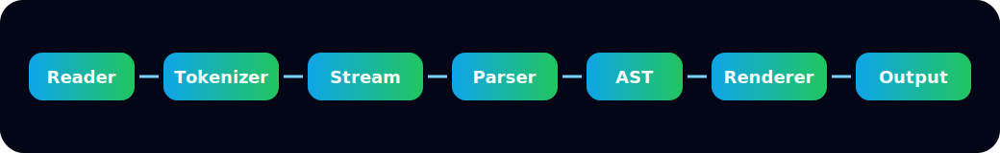

# MarkForge


<p align="center"></p>

MarkForge is an **alpha-stage**, offline-first Markdown processing toolkit built around a portable ANSI C core. It currently provides a tokenizer, token stream, line-oriented parser, AST, basic renderers, diagnostics, a small CLI, release scripts, and a static website/playground prototype.

MarkForge is not yet CommonMark-complete and is not a stable 1.0 library. The repository is suitable for public alpha evaluation, testing, and contribution.

## Implemented Today

- ANSI C support libraries: memory, containers, strings, filesystem, logging, diagnostics, CLI helpers, configuration key/value storage.
- Markdown tokenizer with positions and UTF-8 validation.
- Token stream API with peek, advance, lookahead, checkpoint and restore.
- Line-oriented parser for a practical subset: headings, paragraphs, simple emphasis, inline code, links, images, simple lists, blockquotes, code fences, horizontal rules, HTML passthrough-as-text/safe mode, and basic math nodes.
- AST with node IDs, parent/child/sibling links, visitor traversal, validation, printer and statistics.
- Renderers for HTML, JSON, XML, plain text and simple Markdown formatting.
- Basic linter/validator diagnostics for malformed inline code, trailing whitespace and duplicate headings.
- CLI executable at `tools/markforge`.
- Static website prototype in `website/` with Monaco editor integration and a local WASM version-check module.

## Important Limitations

- The parser is not CommonMark-complete.
- There is no separate production lexer module yet; tokenizer and token stream are implemented.
- Nested list semantics, full tables, footnotes, task lists, callouts, automatic links, full HTML block rules and complete escaping rules are not production-complete.
- Configuration is flat key/value text only. JSON, YAML and full INI parsing are not implemented.
- Plugins are local/static metadata registrations only; dynamic loading and isolation are not implemented.
- The website playground uses a TypeScript parser approximation plus a small local WASM module that verifies WASM loading. It does not yet execute the full C parser in WebAssembly.
- Website build requires Node/npm dependencies from `website/package.json`; runtime output is static.

## Build

```sh
make
make test
make benchmark
make website-check
```

CMake is also available:

```sh
cmake -S . -B build
cmake --build build
ctest --test-dir build --output-on-failure
```

## CLI Examples

```sh
tools/markforge --version
tools/markforge render-html README.md
tools/markforge dump-tokens README.md
tools/markforge validate README.md
tools/markforge lint README.md
```

## Website

```sh
make website-check
make website-build
```

The website is static and designed for GitHub Pages. The checked-in WASM module only exports a version function; full C parser WASM integration is planned.

## Project Status

Current release gate decision: **approved as alpha**.

The project prioritizes correctness over feature count. Documentation should distinguish implemented, partial and planned capabilities.
